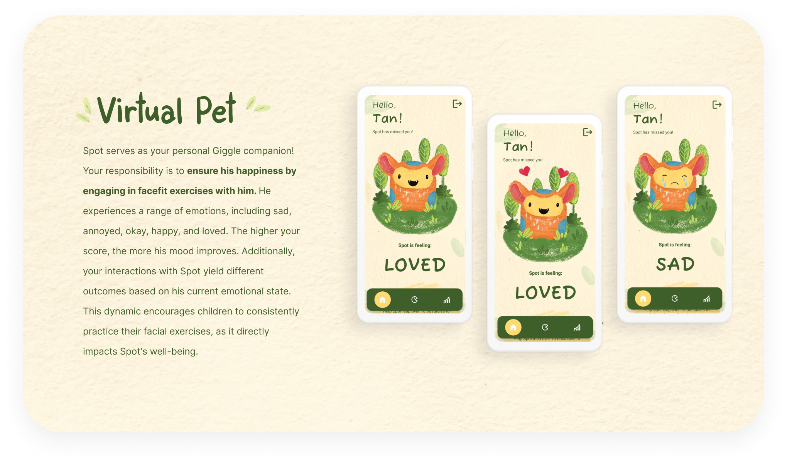

# FaceFit Meadow - React Native App


<!-- HEADER SECTION -->
<h5 align="center" style="padding:0;margin:0;">Alexa Pettitt</h5>
<h5 align="center" style="padding:0;margin:0;">21100290</h5>
<h6 align="center">DV300 | 2023</h6>
</br>
<p align="center">
  <a href="https://github.com/AlexaPea/FaceFitMeadow">
    
  </a>
  
  <h3 align="center">FaceFit Meadow</h3>

  <p align="center">
        A mobile application for children's facial therapy integrating AI technology.
 <br>
      <a href="https://github.com/AlexaPea/FaceFitMeadow"><strong>Explore the docs »</strong></a>
   <br>
</p>


## Table of Contents
* [About The Project](#about-the-project)
  * [Project Description](#project-description)
  * [Built With](#built-with)
* [Getting Started](#getting-started)
  * [Prerequisites](#prerequisites)
  * [How To Install](#how-to-install)
* [Development Process](#development-process)
  * [Concept Process](#concept-process)
  * [Implementation Process](#implementation-process)
    * [The Functionality](#the-functionality)
    * [Above & Beyond](#above--beyond)
    * [Reviews & Testing](#reviews--testing)
    * [Challenges, Highlights & Learnings](#challenges-highlights--learnings)
    * [Future Implementation](#future-implementation)
* [Roadmap](#roadmap)
* [Contributing](#contributing)
* [Authors](#authors)
* [License](#license)
* [Contact](#contact)
* [Acknowledgements](#acknowledgements)


## About the App

### App Description
FaceFit Meadow is a revolutionary React Native app designed to inspire and assist children facing unique health challenges, such as Facial Nerve Palsy and Neuromuscular Disorders. It transforms facial therapy and facial exercise into an enjoyable and engaging experience.

FaceFit Meadow introduces a virtual pet, your therapy buddy, eager to embark on exciting adventures with you. By playing a game that simulates your pet's world, you engage in facial exercises that are not only entertaining but also therapeutic. The game uses advanced AI smile detection powered by Google's ML Kit, making it a fun and interactive way to improve your facial muscle strength and coordination.

**Key Features**
* Virtual pet companion for therapy
* Interactive game using facial exercises
* Smile detection with Google's ML Kit
* Progress tracking
* Motivational badges and rewards

### Built With
* [ReactNative](https://reactnative.dev/)
* [Firebase](https://firebase.google.com/)
* [Google ML Kit Face Detection](https://developers.google.com/ml-kit)

## Getting Started

### Prerequisites
- React Native development environment set up
- Firebase account for backend services

## Getting Started

### Prerequisites
- Node.js and npm installed
- React Native development environment set up
- Firebase account for backend services

### Installation
To get started with FaceFit Meadow, follow these steps:

1. **Clone the repository:**
   - Using GitHub Desktop:
     - Open GitHub Desktop and go to `File` > `Clone Repository`.
     - Enter `https://github.com/AlexaPea/FaceFitMeadow.git` into the URL field and press the `Clone` button.
   - Using Command Line:
     ```sh
     git clone https://github.com/AlexaPea/FaceFitMeadow.git
     ```
     
2. **Install dependencies:**
   - Navigate into the cloned directory (`FaceFitMeadow`).
   - Run the following command to install all required dependencies:
     ```sh
     npm install
     ```
   
3. **Set up Firebase:**
   - Create a Firebase project (if you haven't already) on the [Firebase Console](https://console.firebase.google.com/).
   - Set up Firebase authentication and Firestore database according to your app's requirements.
   - Add your Firebase configuration details to your app.

4. **Run the app:**
   - Once everything is set up and dependencies are installed, start the application using:
     ```sh
     npm start
     ```
   - This will launch the app in development mode. You can run the app on your device using the Expo Go app or on an emulator by following the instructions in the Expo DevTools.

5. **Explore and contribute:**
   - You're all set! Explore the features and functionalities of FaceFit Meadow. If you'd like to contribute, feel free to fork the repository and create a pull request with your changes.


### Concept Process
`Conceptual Process`

To kickstart the conceptual phase, I delved into the project brief, ensuring a clear and thorough understanding of the requirements and objectives.


#### Brainstorm
Subsequently, I conducted a brainstorming session to identify potential problems I could address. My intention was to create something meaningful, and I have a particular interest in developing apps for children. This inspired me to create an app that could assist with therapy. Following numerous brainstorming sessions, I made the decision to develop a therapy app specifically for children, with a particular focus on facial therapy. As a result, I crafted the following "how might we" statement:


Once I was aware of the requirements and had come up with an idea, I was able to progress to the ideation process.


#### Idea Generation
I then came up with the idea of Facefitmeadow.


## Development Process
The `Development Process` is the technical implementations and functionality done in the frontend and backend of the application.

Once I had finalized the designs, the real fun began.

## Implementation Process
I utilized React Native, a free and open-source framework for mobile app development, to create this project. React Native enabled me to build the application using a single codebase, resulting in a cross-platform app.

Firebase, a comprehensive suite of backend services, was used for user authentication and storing app data. Firebase Authentication ensured secure user login and registration, while Firestore database provided a scalable and real-time storage solution.

Google ML Kit Face Detection, is an AI that scans a users face and is able to detect if the user is smiling or not.

* Utilized and implemented React Native for the frontend.
* Integrated Firebase for user authentication and data storage.
* Integrated Google ML Kit Face Detection
* Implemented user registration, login, and profile management features.

### The Functionality
### Login/Sign Up
- Create an account and start your FaceFit journey.

### Onboarding
- Be gently guided into the app and how it works.

### Virtual Pet
- Have your very own Giggly pet accomany you through your adventures - thrive together.

### Interactive Facial Exercise Game
- Play the interactive game by using facial exercises, detected through smile recognition.

### Track Progress
- Explore the progress tracking feature to visualize your advancements over time.

### Gamification Feature
- Stay motivated by earning badges and rewards for consistent engagement.


### Above & Beyond
<!-- stipulate all of the functionality you included in the project -->
<!-- This is your time to shine, explain the technical nuances of your project, how did you achieve the final outcome!-->

* Gamification - by implementing gamification features and tools, I explored functionality that we had previously not learnt.
* Interaction animations - hand made animations were created for the Spot interaction.
* Hand drawn illustrations - the entire application was illustrated by me.

### Reviews & Testing
In order to test the application I conducted a user testing session with my fellow classmates. Here I found that the application felt anti-climatic and needed more user friendly details during the sign in and registration process, such as view password. I then made the adjustments needed.

### Challenges, Highlights & learnings

#### Challenges
Facing the initial challenge of finding an idea that truly ignited my passion, I was determined to create something with a profound impact. However, working on a project that involved AI technology, particularly the integration of smile detection into the gaming experience, presented significant hurdles. It demanded numerous refinements and put my skills to the test. In the end, despite these challenges, I derived immense satisfaction from the final outcome, which represented a significant achievement for me.

#### Highlights
I can confidently say that this project was the highlight of my year. While it may not have been the simplest undertaking, I found immense enjoyment in every aspect of it. I viewed it as a genuine passion project, and witnessing the transformation of my concept into a gamified app was a truly amazing experience.

#### Learnings
This project served as a remarkable learning experience, particularly in the realm of AI and its practical implementation. I gained valuable insights into how AI can be harnessed as a powerful tool for creating positive impact. Additionally, it highlighted how the experiences throughout the year have equipped me to tackle any project I set my mind to.

#### Future Implementation
In future, I would like to add more games that require different facial exercises. I would also like to take the interactions with Spot a step further.


## Final Outcome


<br/>

## Roadmap

See the [open issues](https://github.com/AlexaPea/FaceFitMeadow) for a list of proposed features (and known issues).

<!-- CONTRIBUTING -->
## Contributing

Contributions are what makes the open-source community such an amazing place to learn, inspire, and create. Any contributions you make are **greatly appreciated**.

1. Fork the Project
2. Create your Feature Branch (`git checkout -b feature/AmazingFeature`)
3. Commit your Changes (`git commit -m 'Add some AmazingFeature'`)
4. Push to the Branch (`git push origin feature/AmazingFeature`)
5. Open a Pull Request


<!-- AUTHORS -->
## Authors

* **Alexa Pettitt** - [AlexaPea](https://github.com/AlexaPea/FaceFitMeadow)

<!-- LICENSE -->
## License

This project is protected by all rights reserved. No part of this repository may be reproduced, distributed, or transmitted in any form or by any means, without the prior written permission of the repository owner.


<!-- LICENSE -->
## Contact

* **Alexa Pettitt** - [alexapettitt14@gmail.com](mailto:alexapettitt14@gmail.com) - [@instagram_handle](https://www.instagram.com/byAlexaPettitt/) 
* **Project Link** - https://github.com/AlexaPea/FaceFitMeadow

<!-- ACKNOWLEDGEMENTS -->
## Acknowledgements
* [My Lecturer: Armand Pretorius](https://github.com/Armand-OW)
* [Stack Overflow](https://stackoverflow.com/)
* [React Native Documentation](https://reactnative.dev/)
* [Firebase Documentation](https://firebase.google.com/)
* [React Native Game Tutorial](https://www.youtube.com/watch?v=dhpjjAxKbHE)
* [Google ML Kit - Face Detection](https://developers.google.com/ml-kit)

[linkedin-shield]: https://img.shields.io/badge/-LinkedIn-black.svg?style=flat-square&logo=linkedin&colorB=555
[linkedin-url]: https://www.linkedin.com/in/alexa-pettitt/
[instagram-shield]: https://img.shields.io/badge/-Instagram-black.svg?style=flat-square&logo=instagram&colorB=555
[instagram-url]: https://www.instagram.com/byAlexaPettitt/