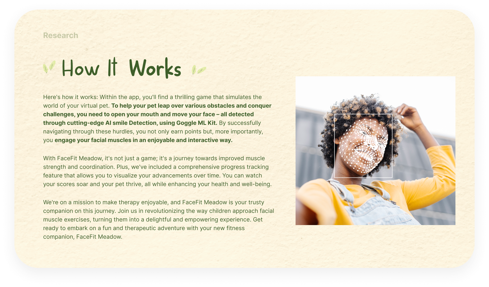
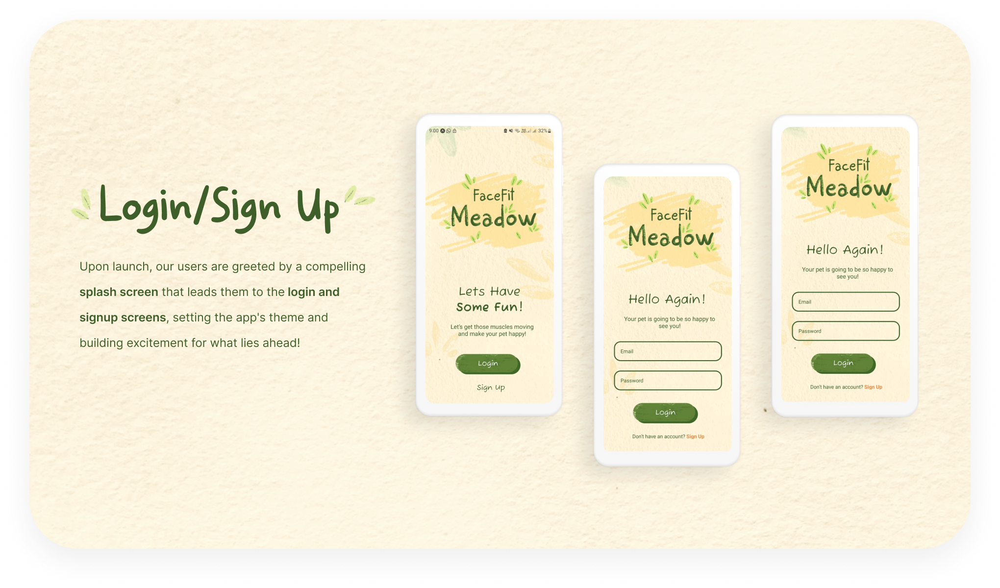

# FaceFit Meadow - React Native App

<h6 align="center">Alexa Pettitt 21100290 DV 300</h6>

 
   
   

  
  

  
  <h3 align="center">FaceFit Meadow</h3>

## Table of Contents
* [About the App](#about-the-app)
    * [App Description](#app-description)
    * [Key Features](#key-features)
* [Getting Started](#getting-started)  
    * [Prerequisites](#prerequisites)
    * [Installation](#installation)
* [User Guide](#user-guide)
* [Development Process](#development-process)
* [License](#license)
* [Contact](#contact)
* [Acknowledgements](#acknowledgements)

## About the App

FaceFit Meadow is a revolutionary React Native app designed to inspire and assist children facing unique health challenges, such as Facial Nerve Palsy and Neuromuscular Disorders. It transforms facial therapy and facial exercise into an enjoyable and engaging experience.

### App Description

FaceFit Meadow introduces a virtual pet, your therapy buddy, eager to embark on exciting adventures with you. By playing a game that simulates your pet's world, you engage in facial exercises that are not only entertaining but also therapeutic. The game uses advanced AI smile detection powered by Google's ML Kit, making it a fun and interactive way to improve your facial muscle strength and coordination.

**Key Features**
* Virtual pet companion for therapy
* Interactive game using facial exercises
* Smile detection with Google's ML Kit
* Progress tracking
* Motivational badges and rewards

## Getting Started

### Prerequisites
- React Native development environment set up
- Firebase account for backend services

### Installation
1. Clone the repository.
2. Install the necessary dependencies.
3. Configure Firebase for backend services.
4. Run the app on your device or simulator.

## Development Process

### Concept Process

To kickstart the conceptual phase, I delved into the project brief, ensuring a clear and thorough understanding of the requirements and objectives.

#### Brainstorm
Subsequently, I conducted a brainstorming session to identify potential problems I could address. My intention was to create something meaningful, and I have a particular interest in developing apps for children. This inspired me to create an app that could assist with therapy. Following numerous brainstorming sessions, I made the decision to develop a therapy app specifically for children, with a particular focus on facial therapy. As a result, I crafted the following "how might we" statement:

#### Idea Generation
I then came up with the idea of Facefitmeadow.

#### Mood boards
Once I had an idea of what the app would be, I was able to further create the visual/brand identity, I created mood boards and discussed the stylistic approach I would take. I ultimately decided on a fun and engaging style to make the therapy enjoyable.

#### Wireframes
Lastly, I began wireframing, which allowed for smoother front-end development.

## Implementation Process
I utilized React Native, a free and open-source framework for mobile app development, to create this project. React Native enabled me to build the application using a single codebase, resulting in a cross-platform app.

Firebase, a comprehensive suite of backend services, was used for user authentication and storing app data. Firebase Authentication ensured secure user login and registration, while Firestore database provided a scalable and real-time storage solution.

Google ML Kit Face Detection, is an AI that scans a users face and is able to detect if the user is smiling or not.

* Utilized and implemented React Native for the frontend.
* Integrated Firebase for user authentication and data storage.
* Integrated Google ML Kit Face Detection
* Implemented user registration, login, and profile management features.

## Functionality
### Login/Sign Up
- Create an account and start your FaceFit journey.

### Onboarding
- Be gently guided into the app and how it works.

### Virtual Pet
- Have your very own Giggly pet accomany you through your adventures - thrive together.

### Interactive Facial Exercise Game
- Play the interactive game by using facial exercises, detected through smile recognition.

### Track Progress
- Explore the progress tracking feature to visualize your advancements over time.

### Gamification Feature
- Stay motivated by earning badges and rewards for consistent engagement.

## Development Process

### Challenges
Facing the initial challenge of finding an idea that truly ignited my passion, I was determined to create something with a profound impact. However, working on a project that involved AI technology, particularly the integration of smile detection into the gaming experience, presented significant hurdles. It demanded numerous refinements and put my skills to the test. In the end, despite these challenges, I derived immense satisfaction from the final outcome, which represented a significant achievement for me.

### Highlights
I can confidently say that this project was the highlight of my year. While it may not have been the simplest undertaking, I found immense enjoyment in every aspect of it. I viewed it as a genuine passion project, and witnessing the transformation of my concept into a gamified app was a truly amazing experience.

### Learnings
This project served as a remarkable learning experience, particularly in the realm of AI and its practical implementation. I gained valuable insights into how AI can be harnessed as a powerful tool for creating positive impact. Additionally, it highlighted how the experiences throughout the year have equipped me to tackle any project I set my mind to.

### License
Distributed under the MIT License. See `LICENSE` for more information.

## Contact
* **Alexa Pettitt** - [Your GitHub](https://github.com/AlexaPea)
* **Project Link** - [GitHub Repository](https://github.com/AlexaPea/FaceFitMeadow)

## Acknowledgements
* https://developers.google.com/ml-kit
* https://firebase.google.com/
* https://reactnative.dev/
* https://www.youtube.com/watch?v=dhpjjAxKbHE
